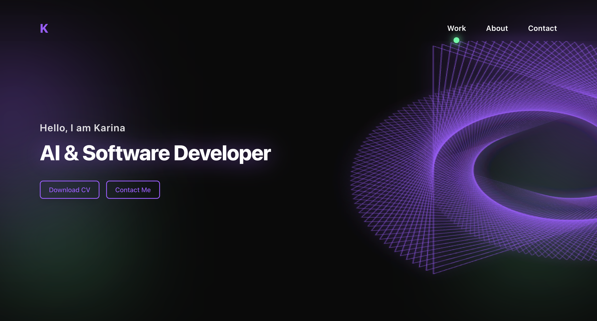

# Personal Portfolio

A modern, interactive portfolio website built with React, featuring animated elements and a clean design.



## Features

- **Animated Triangle Sweep**: Interactive canvas animation with hover effects
- **Responsive Design**: Optimized for desktop and mobile devices
- **Modern UI**: Clean, minimalist design with cyberpunk-inspired colors
- **Smooth Animations**: Custom cursor tracking and interactive elements
- **Contact Form**: Professional contact page with service selection

## Tech Stack

- React 18
- React Router
- Tailwind CSS
- Canvas API for animations
- Vite for build tooling

## Getting Started

1. **Clone the repository**
   ```bash
   git clone <your-repo-url>
   cd personal-portfolio
   ```
